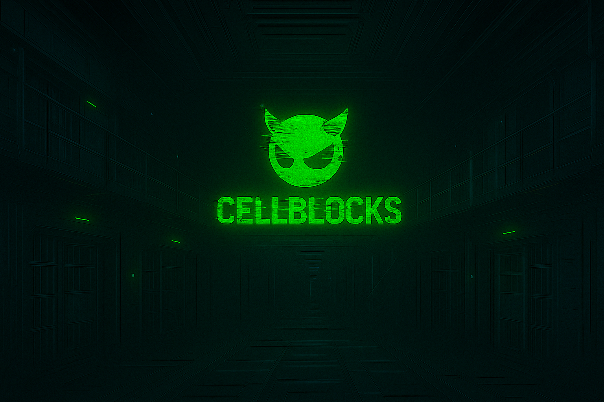

```
            __ __ __    __            __
.----.-----|  |  |  |--|  .-----.----|  |--.-----.
|  __|  -__|  |  |  _  |  |  _  |  __|    <|__ --|
|____|_____|__|__|_____|__|_____|____|__|__|_____|
```



# Introduction

This project is a lightweight container building and runtime environment built on FreeBSD jails, designed for high performance and a minimal memory footprint. It supports both UFS/unionfs and ZFS storage backends and assigns each container its own PTY, providing a persistent, attachable console for interactive access and debugging. The system is implemented in C, Shell, and Go, combining low-level efficiency with scriptable flexibility.

The container build system features a domain-specific language with a syntax closely resembling Dockerfiles, making it intuitive for users familiar with container workflows while remaining tightly integrated with the FreeBSD ecosystem. At runtime, container orchestration is handled by Warden, which allows you to declaratively specify containers to launch at startup, define port mappings, volumes, and network modes. Networking leverages FreeBSD’s native mechanisms, supporting both bridge and NAT modes through the PF firewall, and includes support for OS auditing and mtree-based snapshots for file integrity monitoring (FIM).

Future development will focus on achieving OCI compliance, enabling interoperability with existing container ecosystems while preserving the unique performance, security, and simplicity advantages of the FreeBSD jail model.


## Building cblock daemon and client

```
% git clone https://github.com/csjayp/cblocks.git
% cd cblocks
% make

```

## Installing

First, install the binaries and create the root file system for your cellblock daemon:

```
% sudo make install
% make clean
% sudo zfs create ssdvol0/cblocks
% sudo zfs create ssdvol0/cblocks/instances
% sudo zfs create ssdvol0/cblocks/images
```

Modify the rc.conf to include the setup (make sure to substitute the ZFS path with your own):

```
cblockd_enable=YES
cblockd_data_dir="/ssdvol0/cblocks"
cblockd_fs="zfs"
```

Next, start the daemon:

```
% sudo service cblockd start
```

Now that you know where your root directory is, you can install the support scri
pts that are required for cblockd's operation (note: sequencing is important, because cblockd will create the necessary directories for your support scripts).

```
% cd src/shell
% sudo make install DESTDIR=/ssdvol0/cblocks 
```

### Creating the base Forge image

The forge image contains the toolchain to which facilitates all the operations
that can occur in the `Cblockfile`. This is the prime image, that must be present
to build other cellblocks. This image is created on the server using the following
steps:

```
% cd ../../tools
% mdkdir forge
% cd forge
% sudo ../genforge.sh
```
When you look in your current working directory, you will see the base
utilities and libraries needed to facilitate the operations within a
Cblockfile.

```
% tree 
.
├── bin
│   ├── cp
│   ├── fetch
│   ├── ln
│   ├── mkdir
│   ├── mktemp
│   ├── rm
│   ├── sh
│   └── tar
├── lib
│   ├── libarchive.so.7
│   ├── libbsdxml.so.4
│   ├── libbz2.so.4
│   ├── libc.so.7
│   ├── libcrypto.so.111
│   ├── libedit.so.8
│   ├── libfetch.so.6
│   ├── liblzma.so.5
│   ├── libmd.so.6
│   ├── libncursesw.so.9
│   ├── libprivatezstd.so.5
│   ├── libssl.so.111
│   ├── libthr.so.3
│   └── libz.so.6
├── libexec
│   └── ld-elf.so.1
└── libmap.conf

3 directories, 24 files
```

Next, prepare your tar file. This will be used by the daemon service to
to create your first image. With this image, you will be ready to contruct
others:

```
% tar -czvpf ../forge.tgz .
```

Now that your forge image is archived up, you can submit it to the daemon
which will convert it into your first image (make sure you are using the correct
data directory):

```
% sudo cblockd --zfs --data-directory /ssdvol0/cblocks --create-forge ../forge.tgz
            __ __ __    __            __
.----.-----|  |  |  |--|  .-----.----|  |--.-----.
|  __|  -__|  |  |  _  |  |  _  |  __|    <|__ --|
|____|_____|__|__|_____|__|_____|____|__|__|_____|

version 0.0.0
-- Constructing the base forge image for future forging operations
-- Forge creation returned 0
%
```

Next you can verify your image:

```
% sudo cblock images
IMAGE            TAG                      SIZE CREATED             
forge            latest                 13.36M  2021-05-24 19:23:19
%
```

### Creating base FreeBSD image

Now you are ready to start creating cellblocks. As a good first example, I typically
like to create a base FreeBSD image. I generally use the Cblock file included in the
examples called "base", in this directory you will see a single file that will construct
a full freebsd image based on the distfiles:

```
% cd ../../examples/base/
% cat Cblockfile

FROM forge:latest

RUN "mkdir -p imgbuild/root"
ENV "SSL_CA_CERT_FILE" = "/etc/ca-root-nss.crt"
ADD https://download.freebsd.org/ftp/releases/amd64/12.2-RELEASE/base.txz imgbuild/root
ROOTPIVOT imgbuild

OSRELEASE 12.2-RELEASE
ENTRYPOINT [ "/bin/tcsh" ]
```

This is a very simple Cblockfile. Lets go through it line by line so we understand what is happening here:

| Step | Command | Description |
|------|---------|-------------|
| 1 | `FROM forge:latest` | Instructs the builder to use the `forge:latest` as the base image |
| 2 | `RUN "mkdir -p imgbuild/root"` | We create a root directory. It should be noted that this is only required if you are going to use the `ROOTPIVOT` command, which allows you to populate a directory (similar to when you do a `make installworld DESTDIR=/foo`. `ROOTPIVOT` instructs the builder to use this directory as the root for the new image. |
| 3 | `"SSL_CA_CERT_FILE" = "/etc/ca-root-nss.crt"`| Sets the environment variable to the path of our CA keys which gets copied over during the forging process. |
| 4 | `ADD https://download.freebsd.org/ftp/releases/amd64/12.1-RELEASE/base.txz imgbuild/root` | Similar to docker, `ADD` will add files from the ocal file system, or https to the target directory. If the file is a compressed archive, it will decompress and extract it to the target directory |
| 5 | `ROOTPIVOT imgbuild` | Instructs the builder to use the `imgbuild` directory for the image when it creates it |
| 6 | `OSRELEASE 12.1-RELEASE` | Set the OS release, this could be useful when running `-STABLE` kernels for example, but want the packages from the last release (among other things). |
| 7 | `ENTRYPOINT [ "/bin/tcsh" ]` | Finally specify the entry point for the cellblock, in this case we are using `tcsh` |

**NOTE**: Anytime you are using the `ROOTPIVOT` function, you will need to make sure to include you `ADD` a `resolv.conf` into the new image root if you wan't to use it as a persistent cellblock.

If you are using the base cellblock to build subsequent cellblocks, the build system will automatically inject the host's resolv.conf into the target container if one is not supplied.

Now lets build it:

```
% sudo cblock build -n freebsd-13_4 .
-- Preparing local build context...
-- Transmitting build context to cblock daemon (2560) bytes...
-- Bootstrapping build stages 1 through 1
-- Executing stage (1/1) : FROM forge:latest
-- Step 1/4 : RUN mkdir -p imgbuild/root
-- Step 2/4 : ENV SSL_CA_CERT_FILE=/etc/ca-root-nss.crt
-- Step 3/4 : ADD https://download.freebsd.org/ftp/releases/amd64/12.2-RELEASE/base.txz imgbuild/root
-- Step 4/4 : ROOTPIVOT imgbuild
-- Build Stage(s) complete. Writing container image...
-- Cleaning up ephemeral images and build artifacts
-- build occured in 150 seconds: status code 0
%
```
That now you should have a base image, you can view your images by typing:
```
% sudo cblock images
IMAGE            TAG                      SIZE CREATED
freebsd-13_4     latest                975.58M  2021-05-27 00:36:20
forge            latest                 10.17M  2021-05-27 00:32:08
%
```

### Launching your Cellblock

Now we are ready to launch the container. Note with `--host-networking` the cblock daemon
will lookup the source address associated with your default outbound interface, and use
that. So take care if you cblock daemon is directory connected to the internet.

```
% sudo cblock launch --name freebsd-13_4 --host-networking 
cellblock: container launched: instance: 7d19953ce1
root@7d19953ce1:/ # id
uid=0(root) gid=0(wheel) groups=0(wheel),5(operator)
root@7d19953ce1:/ # 
```

### Detaching from your Cellblock

Each cellblock instance has a TTY attached to it. WHen you launch your cellblock you will be
connected to the console by default. If you want to launch them asynchronously, you can use
the `--no-attach` option on launch. If you want to dis-connect from the console and return to
doing other things, simply press `ctrl+q` and you will be dropped back to the shell. Your
cellblock will continue running. Should you want to re-connect to it, grab the instance ID
and use the console sub command:

```
% sudo cblock instances
INSTANCE    IMAGE           TTY          PID     TYPE                UP
a5ec8053ea  freebsd-13_4    /dev/pts/2   2374    assembled         276s
% sudo cblock console --name a5ec8053ea
root@a5ec8053ea:/ # 
```
