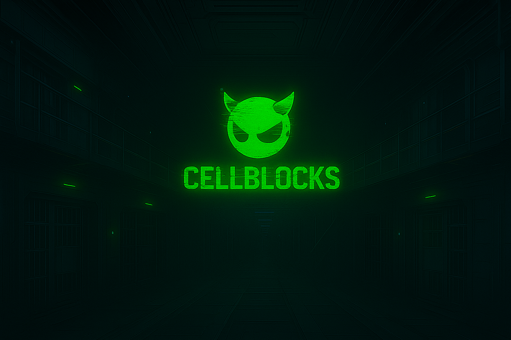

```
            __ __ __    __            __
.----.-----|  |  |  |--|  .-----.----|  |--.-----.
|  __|  -__|  |  |  _  |  |  _  |  __|    <|__ --|
|____|_____|__|__|_____|__|_____|____|__|__|_____|
```



# Introduction

This project is a lightweight container building and runtime environment built on FreeBSD jails, designed for high performance and a minimal memory footprint. It supports both UFS/unionfs and ZFS storage backends and assigns each container its own PTY, providing a persistent, attachable console for interactive access and debugging. The system is implemented in C, Shell, and Go, combining low-level efficiency with scriptable flexibility.

The container build system features a domain-specific language with a syntax closely resembling Dockerfiles, making it intuitive for users familiar with container workflows while remaining tightly integrated with the FreeBSD ecosystem. At start up, container orchestration is handled by Warden, which allows you to declaratively specify containers to launch at startup, define port mappings, volumes, and network modes. Networking leverages FreeBSD’s native mechanisms, supporting both bridge and NAT modes through the PF firewall, and includes support for OS auditing and mtree-based snapshots for file integrity monitoring (FIM).

For deep observability, the environment also publishes cell block–specific DTrace providers, allowing administrators to trace and troubleshoot container lifecycle events and performance characteristics in real time. Future development will focus on OCI compliance, extending interoperability with existing container ecosystems while preserving the performance, security, and simplicity inherent to the FreeBSD jail model.

## Prequisites

In addition to the C compilers, the Go toolchain is required for building components of the system written in Go. Certain utilities are also necessary for full functionality: setaudit is used to apply and pin audit configurations within a container, and subcalc is required to configure container networking. All of these tools are available through the FreeBSD Ports Collection, ensuring easy installation and integration into the build environment.

```
% pkg install subcalc setaudit go125
```

## Building cblock daemon and client

```
% git clone https://github.com/csjayp/cblocks.git
% cd cblocks
% make
```

## Building the client only

The `cblock` client can be built on its own, for example on a Linux host or
CI runner that talks to a remote cblock daemon. This builds `libcblock` and
the `cblock` client, but not the daemon, Warden or `libfsoverride`.
`libcblock` is linked statically, so only the `cblock` binary is installed.

The client builds on FreeBSD, macOS and Linux (glibc or musl) with no
extra configuration. Besides a C compiler and `make`, the Cblockfile parser
requires `flex` and `bison`. On Debian or Ubuntu:

```
% sudo apt-get install build-essential flex bison
% make client-only
% sudo make client-only-install
```

On Alpine, musl does not provide `<sys/queue.h>`, so also install
`bsd-compat-headers`:

```
% sudo apk add build-base flex bison bsd-compat-headers
```

## Installing

First, install the binaries and create the root file system for your cellblock daemon:

```
% sudo make install
% make clean
```

## Configuring

For UFS you can do:

```
% mkdir /usr/cblocks
% mkdir /usr/cblocks/instances
% mkdir /usr/cblocks/images
```

Modify the rc.conf to include the setup (make sure to substitute the ZFS path with your own):

```
cblockd_enable=YES
cblockd_data_dir="/usr/cblocks"
cblockd_fs="ufs"
```

Alternatively for ZFS:

```
% sudo zfs create ssdvol0/cblocks
% sudo zfs create ssdvol0/cblocks/instances
% sudo zfs create ssdvol0/cblocks/images
```

Modify the rc.conf to include the setup (make sure to substitute the ZFS path with your own):

```
cblockd_enable=YES
cblockd_data_dir="/ssdvol0/cblocks"
cblockd_fs="zfs"
```

Next, start the daemon:

```
% sudo service cblockd start
```

Now that you know where your root directory is, you can install the support scripts
that are required for cblockd's operation. cblockd creates the `lib` directory the
scripts are installed into when it starts; if you are installing the scripts before
cblockd has been started, create it first:

```
% sudo mkdir -p /ssdvol0/cblocks/lib
% cd src/shell
% sudo make install DESTDIR=/ssdvol0/cblocks 
```

## UFS Performance Tuning

When using the UFS backend, cblocks uses unionfs to layer container images. Union
vnodes are created lazily on first file access and are subject to normal vnode
recycling when idle, so pressure scales with what containers are actively doing
rather than image size. Each accessed file requires roughly two vnodes: one union
vnode and one UFS vnode for the lower (image) layer. The lower layer vnode is
shared across all containers using the same base image, so for N containers the
cost per accessed file is 1 shared lower vnode plus N union vnodes. Files that are
written to incur a third vnode for the upper (per-instance) layer. During startup
and any operation that walks the filesystem (package installs, find, rsync) union
vnodes accumulate quickly, and running several busy containers against the same base
image can exhaust the default vnode limit more quickly than a non-union workload.

### Checking vnode pressure

```
% sysctl vfs.numvnodes vfs.vnode.param.limit vfs.freevnodes vfs.wantfreevnodes
```

If `vfs.numvnodes` is above 80% of `vfs.vnode.param.limit`, or `vfs.freevnodes`
is consistently below `vfs.wantfreevnodes`, the system is under vnode pressure and
containers may experience degraded lookup performance as the kernel races to recycle
vnodes.

### Calculating a new limit

Each vnode consumes 448 bytes. A reasonable budget is 4-5% of physical RAM:

```
% python3 -c "import os; mem=int(os.popen('sysctl -n hw.physmem').read()); print(int(mem * 0.05 / 448))"
```

### Applying the new limit

To apply immediately:

```
% sysctl kern.maxvnodes=<new_value>
```

To make it permanent, add to `/etc/sysctl.conf`:

```
kern.maxvnodes=<new_value>
```

### Example

On a host with ~4GB RAM the default limit is around 176,000 vnodes. With cblocks
running several containers backed by UFS/unionfs, a value of 350,000 is more
appropriate and costs roughly 75MB of additional kernel memory.

## Setting up networking

Networks are plain FreeBSD interfaces configured by the administrator in
`rc.conf(5)` and `pf.conf(5)`. Containers are attached to them by interface
name with `cblock launch --network <interface>`. The interface type selects
the networking mode:

* A bridge: the container gets its own VNET network stack attached to the
  bridge with an epair. Address configuration (e.g. DHCP) is up to the
  container.
* A loopback with an address: NAT mode. The address and prefix define the
  subnet containers are allocated from, each container address is added as an
  alias on the loopback, and the jail is bound to it.

Example `/etc/rc.conf`:

```
cloned_interfaces="bridge0 lo1"

# Bridged network "l2net" on re0
ifconfig_bridge0_name="l2net"
ifconfig_l2net="addm re0 up"

# NAT network "natnet", containers get addresses from 10.0.0.0/24
ifconfig_lo1_name="natnet"
ifconfig_natnet="inet 10.0.0.1/24"
ifconfig_natnet_descr="re0"

gateway_enable="YES"
pf_enable="YES"
```

NAT networks require PF. Add an outbound NAT rule for each NAT network and the
anchor cblocks uses to load port mappings to `/etc/pf.conf`:

```
nat on re0 from (natnet:network) to any -> (re0)
rdr-anchor "cblock-rdr/*"
```

Use the parenthesized `(natnet:network)` form so the ruleset still loads if
the interface does not exist yet.

Port mappings marked public are redirected from the interface named in the
loopback's description (`ifconfig_natnet_descr`), or from the interface
holding the default route if no description is set. Non-public port mappings
are only reachable from the host via localhost.

```
% sudo cblock launch --name nginx --network natnet --port 443:443:public
% sudo cblock launch --name nginx --network l2net
```

NOTE: IMPORTANT: If you have your bridged network bound to your external interface, you will be exposed
to attack from the internet and will probably want to configure a firewall!

## Creating the base Forge image

The forge image provides the toolchain that enables all operations defined within a Cblockfile. It serves as the base (layer 0) image, which must be present before building any other cellblocks. This image is created on the server using the following steps:

```
% sudo make forge
```
The command above does a bunch of operations but it basically reads various libraries and
utilities and organizes them into an image the has the following hierarchy, then boostraps
or loads the image into your cblock daemon.

```
% tree 
.
├── bin
│   ├── cp
│   ├── fetch
│   ├── ln
│   ├── mkdir
│   ├── mktemp
│   ├── rm
│   ├── sh
│   └── tar
├── lib
│   ├── libarchive.so.7
│   ├── libbsdxml.so.4
│   ├── libbz2.so.4
│   ├── libc.so.7
│   ├── libcrypto.so.111
│   ├── libedit.so.8
│   ├── libfetch.so.6
│   ├── liblzma.so.5
│   ├── libmd.so.6
│   ├── libncursesw.so.9
│   ├── libprivatezstd.so.5
│   ├── libssl.so.111
│   ├── libthr.so.3
│   └── libz.so.6
├── libexec
│   └── ld-elf.so.1
└── libmap.conf

3 directories, 24 files
```

Next you can verify your image:

```
% sudo cblock images
IMAGE            TAG                      SIZE CREATED             
forge            latest                 13.36M  2021-05-24 19:23:19
%
```

### Creating base FreeBSD image

With the environment set up, the next step is to begin creating cellblocks. A good starting point is to build a base FreeBSD image. The included example, named "base", provides a sample Cblockfile located in the examples directory. This file defines the instructions needed to construct a complete FreeBSD image from the standard distribution files.

```
% cd ../../examples/base/
% cat Cblockfile

FROM forge:latest

RUN "mkdir -p imgbuild/root"
ENV "SSL_CA_CERT_FILE" = "/etc/ca-root-nss.crt"
ADD https://download.freebsd.org/ftp/releases/amd64/12.2-RELEASE/base.txz imgbuild/root
ROOTPIVOT imgbuild

OSRELEASE 12.2-RELEASE
ENTRYPOINT [ "/bin/tcsh" ]
```

This is a very simple Cblockfile. Lets go through it line by line so we understand what is happening here:

| Step | Command | Description |
|------|---------|-------------|
| 1 | `FROM forge:latest` | Instructs the builder to use the `forge:latest` as the base image |
| 2 | `RUN "mkdir -p imgbuild/root"` | We create a root directory. It should be noted that this is only required if you are going to use the `ROOTPIVOT` command, which allows you to populate a directory (similar to when you do a `make installworld DESTDIR=/foo`. `ROOTPIVOT` instructs the builder to use this directory as the root for the new image. |
| 3 | `"SSL_CA_CERT_FILE" = "/etc/ca-root-nss.crt"`| Sets the environment variable to the path of our CA keys which gets copied over during the forging process. |
| 4 | `ADD https://download.freebsd.org/ftp/releases/amd64/12.1-RELEASE/base.txz imgbuild/root` | Similar to docker, `ADD` will add files from the ocal file system, or https to the target directory. If the file is a compressed archive, it will decompress and extract it to the target directory |
| 5 | `ROOTPIVOT imgbuild` | Instructs the builder to use the `imgbuild` directory for the image when it creates it |
| 6 | `OSRELEASE 12.1-RELEASE` | Set the OS release, this could be useful when running `-STABLE` kernels for example, but want the packages from the last release (among other things). |
| 7 | `ENTRYPOINT [ "/bin/tcsh" ]` | Finally specify the entry point for the cellblock, in this case we are using `tcsh` |

**NOTE**: Anytime you are using the `ROOTPIVOT` function, you will need to make sure to include you `ADD` a `resolv.conf` into the new image root if you wan't to use it as a persistent cellblock.

If you are using the base cellblock to build subsequent cellblocks, the build system will automatically inject the host's resolv.conf into the target container if one is not supplied.

Now lets build it:

```
% sudo cblock build -n freebsd-13_4 .
-- Preparing local build context...
-- Transmitting build context to cblock daemon (2560) bytes...
-- Bootstrapping build stages 1 through 1
-- Executing stage (1/1) : FROM forge:latest
-- Step 1/4 : RUN mkdir -p imgbuild/root
-- Step 2/4 : ENV SSL_CA_CERT_FILE=/etc/ca-root-nss.crt
-- Step 3/4 : ADD https://download.freebsd.org/ftp/releases/amd64/12.2-RELEASE/base.txz imgbuild/root
-- Step 4/4 : ROOTPIVOT imgbuild
-- Build Stage(s) complete. Writing container image...
-- Cleaning up ephemeral images and build artifacts
-- build occured in 150 seconds: status code 0
%
```
That now you should have a base image, you can view your images by typing:
```
% sudo cblock images
IMAGE            TAG                      SIZE CREATED
freebsd-13_4     latest                975.58M  2021-05-27 00:36:20
forge            latest                 10.17M  2021-05-27 00:32:08
%
```

### Launching your Cellblock

Now we are ready to launch the container. Note with `--host-networking` the cblock daemon
will lookup the source address associated with your default outbound interface, and use
that. So take care if you cblock daemon is directory connected to the internet.

```
% sudo cblock launch --name freebsd-13_4 --host-networking 
cellblock: container launched: instance: 7d19953ce1
root@7d19953ce1:/ # id
uid=0(root) gid=0(wheel) groups=0(wheel),5(operator)
root@7d19953ce1:/ # 
```

### Detaching from your Cellblock

Each cellblock instance has a TTY attached to it. WHen you launch your cellblock you will be
connected to the console by default. If you want to launch them asynchronously, you can use
the `--no-attach` option on launch. If you want to dis-connect from the console and return to
doing other things, simply press `ctrl+q` and you will be dropped back to the shell. Your
cellblock will continue running. Should you want to re-connect to it, grab the instance ID
and use the console sub command:

```
% sudo cblock instances
INSTANCE    IMAGE           TTY          PID     TYPE                UP
a5ec8053ea  freebsd-13_4    /dev/pts/2   2374    assembled         276s
% sudo cblock console --name a5ec8053ea
root@a5ec8053ea:/ # 
```
